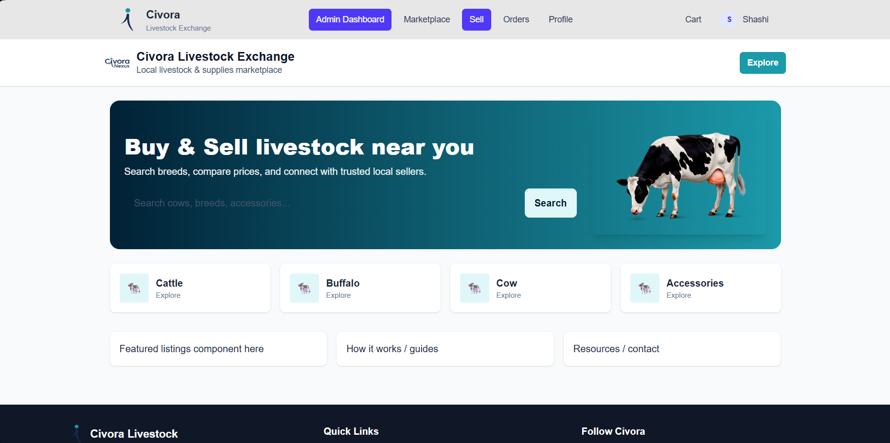
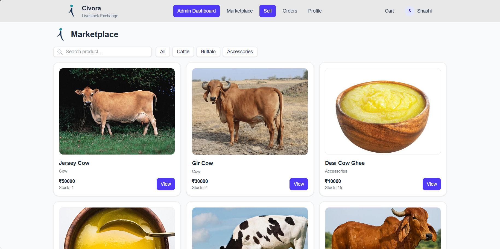
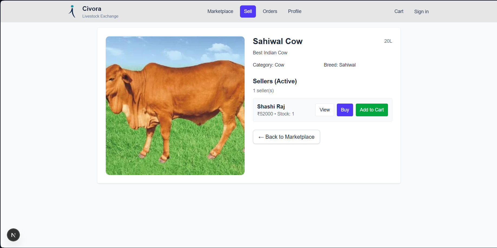
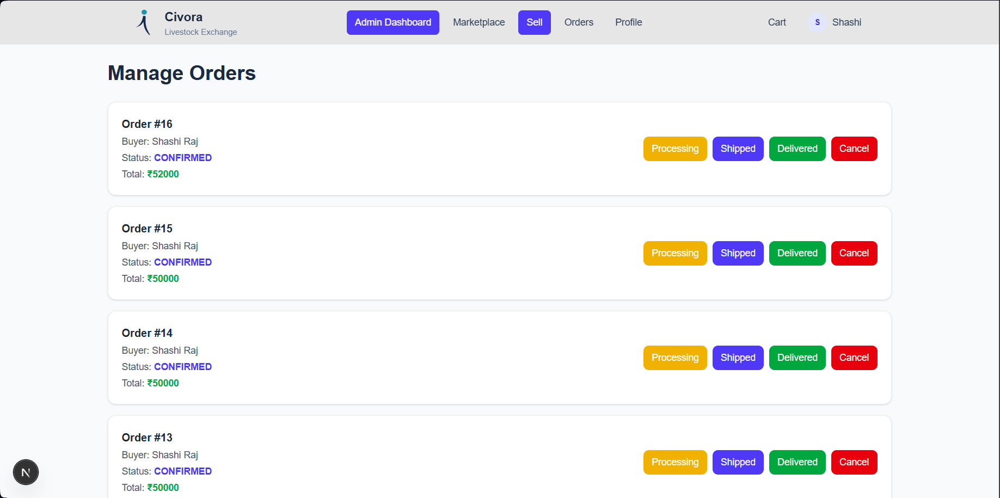

🚀 Built as an independent full-stack project during internship

# 🐄 Livestock Marketplace

🚀 A full-stack web platform that enables farmers and buyers to **buy and sell livestock digitally**, helping overcome the limitations of traditional local cattle markets.

---

## 🚀 Features

* 🔐 User Authentication (Login & Signup)
* 🐄 Add, Update & Manage Livestock Listings
* 🔍 Search & Filter Listings
* 🖼️ Image Upload for Livestock
* 📍 Location-based Listings
* 📊 Structured and Scalable Backend APIs

---

## 📸 Screenshots

### 🏠 Home Page

### 📋 Listings Page

### 🔍 Detail Page

### ➕ Admin Order Managing page

---

## 🛠️ Tech Stack

* **Frontend:** React / Next.js
* **Backend:** Node.js / Express
* **Database:** MySQL
* **Other Tools:** Cloudinary (Image Upload), JWT Authentication

---

## 💡 Problem It Solves

Livestock trading is often limited to physical markets, restricting farmers to local buyers and reducing their reach.

This platform provides a **digital marketplace** where sellers can list livestock and buyers can explore options more efficiently, improving accessibility and connectivity.

---

## 👨‍💻 Development & Contribution

This project was developed during my internship as a full-stack application, where I independently worked on:

- 🧠 Designing the system architecture  
- 🔐 Implementing authentication and user management  
- 🐄 Building livestock listing & search functionality  
- 🔌 Developing backend APIs  
- 🎨 Creating and integrating frontend UI  

This project reflects my ability to build and manage a full-stack application end-to-end.

  

---

## 📈 Future Improvements

* 💬 Real-time chat between buyer and seller
* 🤖 AI-based livestock price suggestions
* 💳 Payment integration

---

## ⭐ If you find this project useful, feel free to give it a star!
